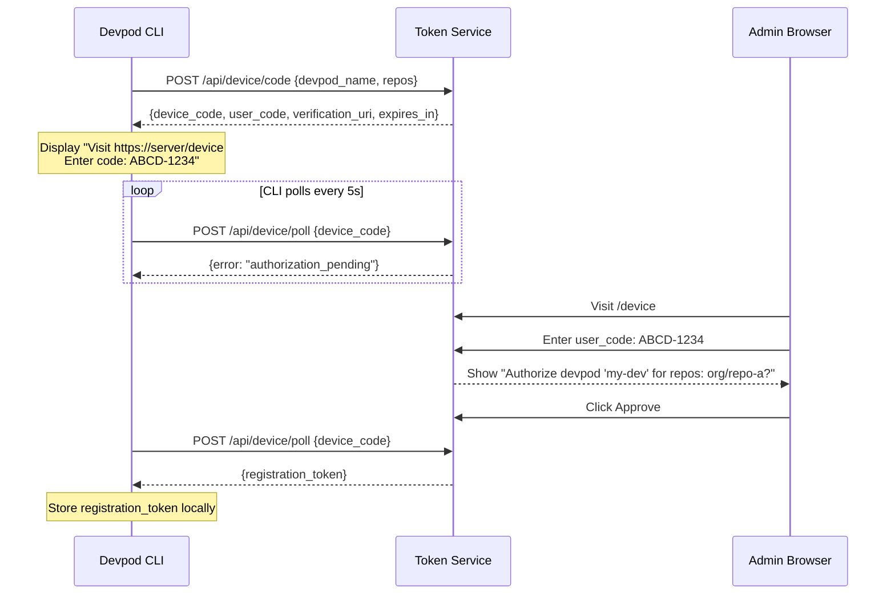
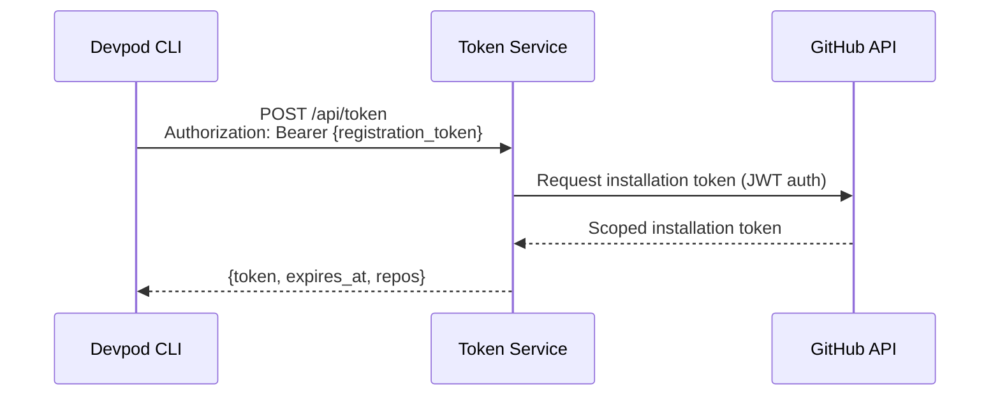

# GitHub App Token Service - Implementation Plan

## Purpose

Generate scoped GitHub App installation tokens for devpods without exposing the GitHub App private key. Devpods can only obtain tokens for repositories they were explicitly registered for. Registration requires admin approval through a web interface secured with passkey authentication.

## Definitions

| Term | Description |
|------|-------------|
| Token Service | Web service with API and admin UI, running on dev server |
| Devpod | Containerized development environment that needs GitHub API access |
| Admin | Human developer who approves registrations via web UI (authenticated with passkey/YubiKey) |
| Device Code | Short code (e.g., "ABCD-1234") displayed on both CLI and web UI to link the authorization |
| Registration Token | Long-lived token issued to devpod after approval, used to request GitHub tokens |
| Installation Token | GitHub App token scoped to specific repositories, expires after 1 hour |

## API Endpoints

### Public API (for devpod CLI)

| Method | Path | Description |
|--------|------|-------------|
| POST | `/api/device/code` | Start device authorization flow, returns device_code + user_code |
| POST | `/api/device/poll` | Poll for authorization completion (returns registration token when approved) |
| POST | `/api/token` | Exchange registration token for GitHub installation token |

### Protected API (requires admin auth)

| Method | Path | Description |
|--------|------|-------------|
| GET | `/api/registrations` | List all registrations with stats |
| GET | `/api/registrations/:id` | Get single registration details |
| DELETE | `/api/registrations/:id` | Revoke a registration |
| GET | `/api/device/pending/:code` | Look up pending authorization by user_code |
| POST | `/api/device/authorize` | Approve or deny a device authorization |

### Web UI Routes

| Path | Description |
|------|-------------|
| GET `/` | Login page (passkey authentication) |
| GET `/dashboard` | List of registered devpods with stats |
| GET `/device` | Device authorization page (enter user_code) |

## Device Authorization Flow (Registration)

Follows OAuth 2.0 Device Authorization Grant (RFC 8628), similar to `gh auth login`.



### User Code Security

The user code (e.g., "ABCD-1234") prevents authorization hijacking. Without it, an attacker could start an auth flow and trick the admin into approving it. The admin verifies the code matches what the CLI displays. Same pattern used by GitHub, Google, Microsoft.

## Token Request Flow

After registration, devpod requests GitHub tokens autonomously (no user interaction).



## Admin Dashboard Features

- Devpod name
- Allowed repositories
- Created date
- Last seen (last token request)
- Token request count
- Status (active/revoked)
- Revoke action with confirmation

## Security Properties

1. GitHub App private key never leaves Token Service
2. Admin authentication requires physical presence (passkey/YubiKey)
3. Device code prevents authorization hijacking
4. Devpod compromise only exposes pre-registered repositories
5. Registration tokens can be revoked via dashboard
6. Installation tokens are short-lived (1 hour)
7. No secrets transmitted to devpod during registration

## Data Structures

```typescript
interface PendingAuthorization {
  device_code: string;        // Secret, used by CLI to poll
  user_code: string;          // Short code shown to user (e.g., "ABCD-1234")
  devpod_name: string;
  requested_repos: string[];
  expires_at: Date;
  status: 'pending' | 'approved' | 'denied';
}

interface Registration {
  id: string;
  devpod_name: string;
  registration_token_hash: string;
  allowed_repos: string[];
  created_at: Date;
  revoked_at: Date | null;
  last_token_request: Date | null;
  token_request_count: number;
}

interface AdminCredential {
  credential_id: string;      // WebAuthn credential ID
  public_key: string;         // WebAuthn public key
  created_at: Date;
}

interface AdminSession {
  session_id: string;
  created_at: Date;
  expires_at: Date;
}
```

## Database

### Stack

- **better-sqlite3**: Synchronous SQLite driver (fast, no async overhead)
- **db-migrate** + **db-migrate-sqlite3**: Schema migrations
- **Plain SQL**: No ORM, direct parameterized queries

### Migration Structure

```
migrations/
  20240101120000-create-admin-credentials.js
  20240101120001-create-admin-sessions.js
  20240101120002-create-pending-authorizations.js
  20240101120003-create-registrations.js
```

### database.json (db-migrate config)

```json
{
  "dev": {
    "driver": "sqlite3",
    "filename": { "ENV": "DATABASE_PATH" }
  },
  "test": {
    "driver": "sqlite3",
    "filename": ":memory:"
  },
  "prod": {
    "driver": "sqlite3",
    "filename": { "ENV": "DATABASE_PATH" }
  }
}
```

### Example Migration

```javascript
// migrations/20240101120000-create-admin-credentials.js
exports.up = function(db) {
  return db.runSql(`
    CREATE TABLE admin_credentials (
      id INTEGER PRIMARY KEY AUTOINCREMENT,
      credential_id TEXT UNIQUE NOT NULL,
      public_key TEXT NOT NULL,
      created_at TEXT NOT NULL DEFAULT CURRENT_TIMESTAMP
    )
  `);
};

exports.down = function(db) {
  return db.runSql('DROP TABLE admin_credentials');
};
```

### Schema Overview

| Table | Purpose |
|-------|---------|
| admin_credentials | WebAuthn credential IDs and public keys |
| admin_sessions | Active login sessions |
| pending_authorizations | Device auth requests awaiting approval |
| registrations | Approved devpods with their allowed repos |

### Query Pattern

```typescript
// src/lib/db.ts
import Database from 'better-sqlite3';

const db = new Database(process.env.DATABASE_PATH);

// Parameterized queries - safe from SQL injection
export function getRegistration(id: string): Registration | undefined {
  return db.prepare('SELECT * FROM registrations WHERE id = ?').get(id);
}

export function createRegistration(reg: Registration): void {
  db.prepare(`
    INSERT INTO registrations (id, devpod_name, registration_token_hash, allowed_repos, created_at)
    VALUES (?, ?, ?, ?, ?)
  `).run(reg.id, reg.devpod_name, reg.registration_token_hash, JSON.stringify(reg.allowed_repos), reg.created_at);
}
```

## Project Structure

```
src/
  index.ts                 # Entry point
  app.ts                   # Express app setup
  routes/
    api.ts                 # API routes
    web.ts                 # Web UI routes
  services/
    auth.ts                # WebAuthn service
    device.ts              # Device authorization
    github.ts              # GitHub API integration
    registration.ts        # Registration management
  lib/
    db.ts                  # Database client (better-sqlite3)
    crypto.ts              # Crypto utilities
migrations/                # db-migrate SQL migrations
  20240101120000-create-admin-credentials.js
  20240101120001-create-admin-sessions.js
  20240101120002-create-pending-authorizations.js
  20240101120003-create-registrations.js
database.json              # db-migrate config
public/                    # Static assets
tests/
  setup.ts                 # Test setup (migrations, auth helpers)
  lib/
    authenticator.ts       # Software FIDO authenticator
  integration/
    auth.integration.test.ts
    device.integration.test.ts
    registration.integration.test.ts
    token.integration.test.ts
```

## Docker Configuration

### docker-compose.dev.yaml

Development environment with hot reload. SQLite data in Docker volume (not host).

```yaml
services:
  app:
    build:
      context: .
      dockerfile: Dockerfile
      target: development
    ports:
      - "3000:3000"
    volumes:
      - .:/app
      - node_modules:/app/node_modules
      - dev_data:/data
    environment:
      - NODE_ENV=development
      - DATABASE_PATH=/data/token-service.db
      - PORT=3000
      - GITHUB_APP_ID=${GITHUB_APP_ID}
      - GITHUB_APP_PRIVATE_KEY=${GITHUB_APP_PRIVATE_KEY}
      - GITHUB_INSTALLATION_ID=${GITHUB_INSTALLATION_ID}
      - RP_ID=localhost
      - RP_NAME=GitHub Token Service (Dev)
      - ORIGIN=http://localhost:3000
    command: npm run dev

volumes:
  node_modules:
  dev_data:
```

### docker-compose.test.yaml

Integration tests with database reset between runs.

```yaml
services:
  app:
    build:
      context: .
      dockerfile: Dockerfile
      target: development
    volumes:
      - .:/app
      - node_modules_test:/app/node_modules
      - test_data:/data
    environment:
      - NODE_ENV=test
      - DATABASE_PATH=/data/token-service.db
      - PORT=3000
      - GITHUB_APP_ID=test-app-id
      - GITHUB_APP_PRIVATE_KEY=test-private-key
      - GITHUB_INSTALLATION_ID=test-installation-id
      - RP_ID=localhost
      - RP_NAME=GitHub Token Service (Test)
      - ORIGIN=http://localhost:3000
    healthcheck:
      test: ["CMD", "wget", "-q", "--spider", "http://localhost:3000/api/health"]
      interval: 5s
      timeout: 3s
      retries: 10

  runner:
    image: node:22
    working_dir: /app
    volumes:
      - .:/app
      - node_modules_test:/app/node_modules
    environment:
      - NODE_ENV=test
      - API_URL=http://app:3000
      - DATABASE_PATH=/data/token-service.db
    depends_on:
      app:
        condition: service_healthy
    command: npm test

volumes:
  node_modules_test:
  test_data:
```

### docker-compose.coolify.yaml

Production deployment on Coolify with persistent volume.

```yaml
services:
  app:
    build:
      context: .
      dockerfile: Dockerfile
      target: production
    ports:
      - "3000:3000"
    volumes:
      - app_data:/data
    environment:
      - NODE_ENV=production
      - DATABASE_PATH=/data/token-service.db
      - PORT=3000
      - GITHUB_APP_ID=${GITHUB_APP_ID}
      - GITHUB_APP_PRIVATE_KEY=${GITHUB_APP_PRIVATE_KEY}
      - GITHUB_INSTALLATION_ID=${GITHUB_INSTALLATION_ID}
      - RP_ID=${RP_ID}
      - RP_NAME=${RP_NAME}
      - ORIGIN=${ORIGIN}
    healthcheck:
      test: ["CMD", "wget", "-q", "--spider", "http://localhost:3000/api/health"]
      interval: 30s
      timeout: 10s
      retries: 3

volumes:
  app_data:
```

### Dockerfile

```dockerfile
FROM node:22-alpine AS base
WORKDIR /app

FROM base AS development
COPY package*.json ./
RUN npm install
COPY . .
CMD ["npm", "run", "dev"]

FROM base AS builder
COPY package*.json ./
RUN npm ci
COPY . .
RUN npm run typecheck

FROM base AS production
COPY package*.json ./
RUN npm ci --omit=dev
COPY --from=builder /app/src ./src
COPY --from=builder /app/public ./public
USER node
CMD ["npm", "start"]
```

## Testing Strategy

### Principles

- **No mocking**: All tests run against real SQLite database and real Express app
- **Real WebAuthn**: Software authenticator implements actual FIDO protocol
- **Isolated tests**: Database reset before each test file
- **Sequential execution**: `fileParallelism: false` since tests share database

### Test Stack

- Vitest (test runner)
- Supertest (HTTP assertions)
- @simplewebauthn/server (WebAuthn implementation)
- Custom SoftwareAuthenticator class (FIDO testing without hardware)

### WebAuthn Testing

Software authenticator that implements WebAuthn protocol:
1. Generates real ECDSA P-256 key pairs
2. Creates valid attestation responses
3. Signs authentication challenges
4. No mocking of crypto operations

### Test Setup Pattern

Uses db-migrate programmatically to run migrations up before tests and down after.

```typescript
// tests/setup.ts
import DBMigrate from 'db-migrate';
import { beforeAll, afterAll, beforeEach } from 'vitest';

const dbmigrate = DBMigrate.getInstance(true, { env: 'test' });

beforeAll(async () => {
  await dbmigrate.up();  // Run all migrations
});

afterAll(async () => {
  await dbmigrate.reset();  // Roll back all migrations
});

beforeEach(async () => {
  // Clear data between tests (tables exist, just empty them)
  db.exec(`
    DELETE FROM registrations;
    DELETE FROM pending_authorizations;
    DELETE FROM admin_sessions;
    DELETE FROM admin_credentials;
  `);
});

// Helper creates real authenticated session via WebAuthn
export async function createAuthenticatedSession(): Promise<string> {
  // Full WebAuthn registration + authentication flow
  // Returns session cookie
}
```

### Running Tests

```bash
npm run docker:test              # Run all tests in Docker
npm run docker:reset-test-db     # Reset test database
```

### vitest.config.ts

```typescript
import { defineConfig } from 'vitest/config';

export default defineConfig({
  test: {
    include: ['tests/**/*.integration.test.ts'],
    globals: true,
    setupFiles: ['tests/setup.ts'],
    fileParallelism: false,
    testTimeout: 10000,
    hookTimeout: 10000,
  },
});
```

## Package Scripts

```json
{
  "scripts": {
    "start": "node --experimental-strip-types src/index.ts",
    "dev": "node --experimental-strip-types --watch src/index.ts",
    "typecheck": "tsc --noEmit",
    "test": "vitest run",
    "test:watch": "vitest",
    "db:migrate": "db-migrate up",
    "db:rollback": "db-migrate down",
    "db:reset": "db-migrate reset && db-migrate up",
    "db:create": "db-migrate create",
    "docker:dev": "docker compose -f docker-compose.dev.yaml up",
    "docker:test": "docker compose -f docker-compose.test.yaml run --rm runner",
    "docker:reset-test-db": "docker compose -f docker-compose.test.yaml down -v && docker compose -f docker-compose.test.yaml up -d app"
  }
}
```

## Implementation Phases

### Phase 1: Core Infrastructure
- Express server with TypeScript (--strip-types)
- better-sqlite3 database client
- db-migrate setup with initial migrations
- Configuration loading (env vars)
- Docker Compose for development
- Health check endpoint

### Phase 2: WebAuthn Authentication
- WebAuthn registration flow (initial admin setup)
- WebAuthn authentication flow (login)
- Session management (secure cookies)
- Auth middleware for protected routes
- Software authenticator for testing
- Auth integration tests

### Phase 3: Device Authorization Flow
- `POST /api/device/code` endpoint
- Secure device_code + user-friendly user_code generation
- `POST /api/device/poll` with RFC 8628 responses
- `GET /api/device/pending/:code` for admin lookup
- `POST /api/device/authorize` for approve/deny
- Registration token generation and hashing
- Device flow integration tests

### Phase 4: Token Generation
- GitHub App JWT generation
- Installation token request to GitHub API
- Repository scoping
- `POST /api/token` endpoint
- Registration token verification
- Usage statistics update
- Token generation integration tests

### Phase 5: Admin Dashboard
- Static file serving for web UI
- Login page with WebAuthn
- Dashboard listing registrations with stats
- Device authorization page
- Revocation with confirmation

### Phase 6: Production Readiness
- Production Dockerfile
- docker-compose.coolify.yaml
- Request logging
- Rate limiting
- Deployment documentation

## Tech Decisions

| Decision | Rationale |
|----------|-----------|
| WebAuthn/Passkeys | Phishing-resistant, works with YubiKey, no passwords, requires physical presence |
| Device Authorization Flow (RFC 8628) | Works for CLI apps, familiar pattern (GitHub/Google), clear authorization confirmation |
| SQLite + better-sqlite3 | Zero config, single file, sync API (no async overhead), fast |
| Plain SQL (no ORM) | Direct control, no abstraction leaks, easier to debug and optimize |
| db-migrate | Framework-agnostic migrations, programmatic API for test setup, supports up/down |
| Supertest + Real Database | Tests actual behavior, catches integration issues, fast with SQLite |
| Software Authenticator | Full WebAuthn testing without hardware, no mocking of security code |
