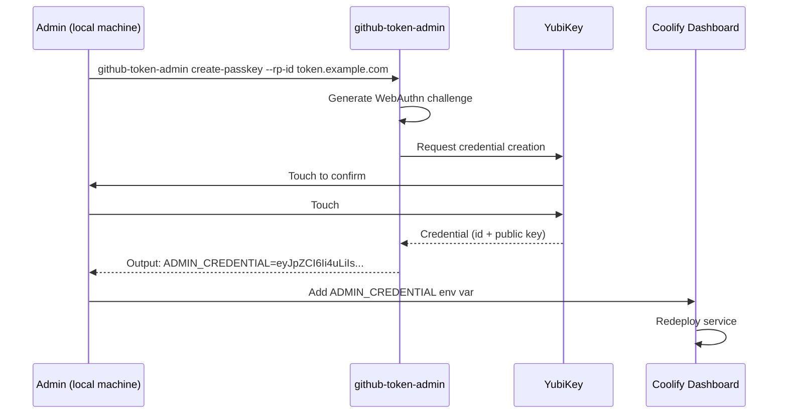
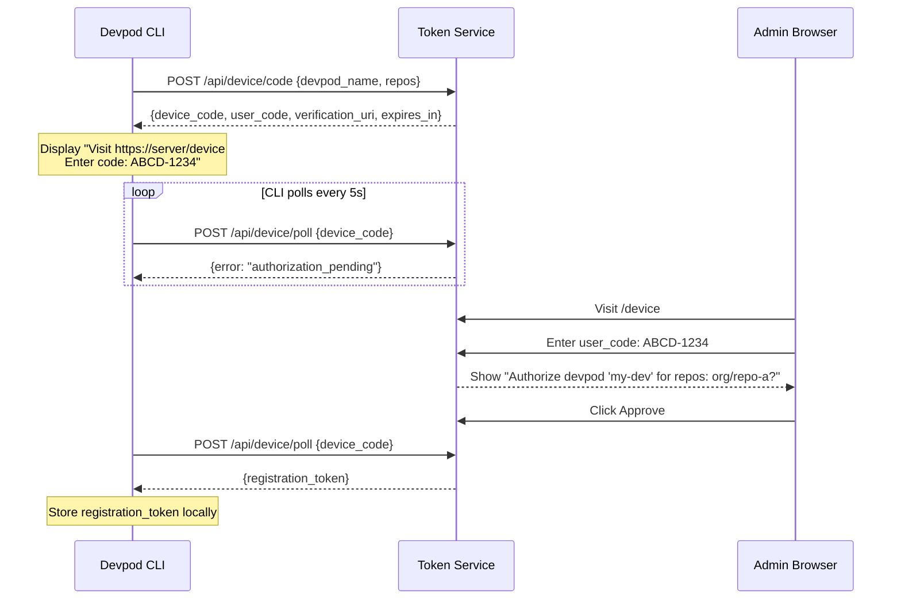
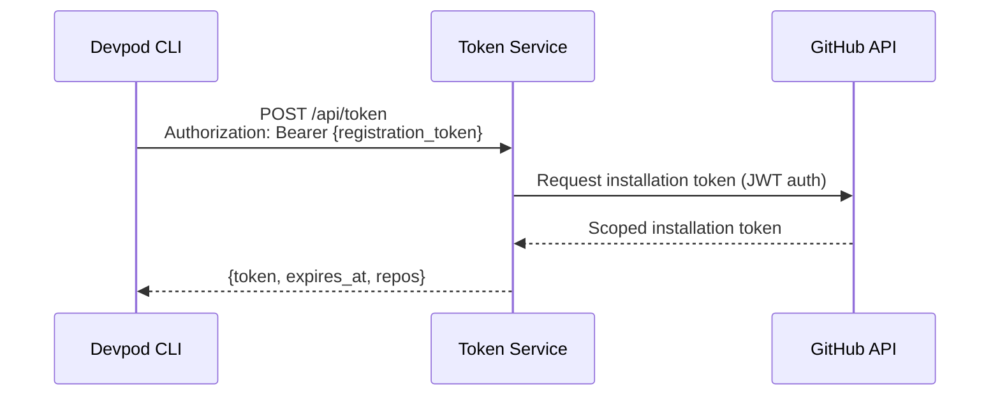

# GitHub App Token Service - Implementation Plan

## Purpose

Generate scoped GitHub App installation tokens for devpods without exposing the GitHub App private key. Devpods can only obtain tokens for repositories they were explicitly registered for. Registration requires admin approval through a web interface secured with passkey authentication.

## Monorepo Structure

| Package | Purpose | Published |
|---------|---------|-----------|
| `@levino/github-token-service` | Express server with WebAuthn login and admin dashboard | No (deployed via Docker) |
| `@levino/github-token-cli` | CLI for devpods to register and request tokens | Yes (npm) |
| `@levino/github-token-admin` | CLI to create passkey on YubiKey (initial setup) | No (runs locally) |

### Why CLI for Passkey Creation?

- **No open registration state**: Server never accepts new passkey registrations via web
- **More secure**: Admin CLI runs locally where the YubiKey is physically present
- **Simpler server**: Only needs to verify passkeys, not register them
- **No database connection needed**: CLI outputs credential as string → add as env var to service

## Definitions

| Term | Description |
|------|-------------|
| Token Service | Web service with API and admin UI, running on dev server |
| Devpod | Containerized development environment that needs GitHub API access |
| Admin | Human developer who approves registrations via web UI (authenticated with passkey/YubiKey) |
| Device Code | Short code (e.g., "ABCD-1234") displayed on both CLI and web UI to link the authorization |
| Registration Token | Long-lived token issued to devpod after approval, used to request GitHub tokens |
| Installation Token | GitHub App token scoped to specific repositories, expires after 1 hour |

## API Endpoints

### Public API (for devpod CLI)

| Method | Path | Description |
|--------|------|-------------|
| POST | `/api/device/code` | Start device authorization flow, returns device_code + user_code |
| POST | `/api/device/poll` | Poll for authorization completion (returns registration token when approved) |
| POST | `/api/token` | Exchange registration token for GitHub installation token |

### Protected API (requires admin auth)

| Method | Path | Description |
|--------|------|-------------|
| GET | `/api/registrations` | List all registrations with stats |
| GET | `/api/registrations/:id` | Get single registration details |
| DELETE | `/api/registrations/:id` | Revoke a registration |
| GET | `/api/device/pending/:code` | Look up pending authorization by user_code |
| POST | `/api/device/authorize` | Approve or deny a device authorization |

### Web UI Routes

| Path | Description |
|------|-------------|
| GET `/` | Login page (passkey authentication only, no registration) |
| GET `/dashboard` | List of registered devpods with stats |
| GET `/device` | Device authorization page (enter user_code) |

## Admin Setup Flow

Initial setup using the admin CLI (runs on local machine with YubiKey).



The admin CLI outputs the credential as a base64-encoded JSON string. Add this as `ADMIN_CREDENTIAL` environment variable in Coolify. The server reads it at startup.

## Device Authorization Flow (Registration)

Follows OAuth 2.0 Device Authorization Grant (RFC 8628), similar to `gh auth login`.



### User Code Security

The user code (e.g., "ABCD-1234") prevents authorization hijacking. Without it, an attacker could start an auth flow and trick the admin into approving it. The admin verifies the code matches what the CLI displays. Same pattern used by GitHub, Google, Microsoft.

## Token Request Flow

After registration, devpod requests GitHub tokens autonomously (no user interaction).



## CLI Usage

### Devpod CLI (`@levino/github-token-cli`)

```bash
# Install globally in devpod
npm install -g @levino/github-token-cli

# Register devpod (interactive - shows code to enter in browser)
github-token register --name my-devpod --repos org/repo-a,org/repo-b

# Get GitHub token (after registration)
github-token get-token

# Configure service URL
github-token config set service-url https://token-service.example.com
```

### Admin CLI (`@levino/github-token-admin`)

```bash
# Production: Use real YubiKey
npx @levino/github-token-admin create-passkey \
  --rp-id token-service.example.com \
  --rp-name "GitHub Token Service"

# Development: Use software authenticator (no hardware needed)
npx @levino/github-token-admin create-passkey \
  --rp-id localhost \
  --rp-name "GitHub Token Service (Dev)" \
  --software

# Output:
# Touch your YubiKey to create passkey...  (or: Using software authenticator)
#
# Success! Add this environment variable to your service:
#
# ADMIN_CREDENTIAL=eyJpZCI6IjRhYjNjZDEyLi4uIiwicHVibGljS2V5IjoiTUZrd0V3WUhLb1pJemow...
#
# Then redeploy the service.
```

The credential string is a base64-encoded JSON containing:
```json
{
  "credentialId": "base64...",
  "publicKey": "base64... (COSE format)"
}
```

The private key **never leaves the YubiKey**. During login:
1. Server sends challenge + credential ID to browser
2. Browser asks YubiKey to sign the challenge
3. YubiKey signs internally, returns signature
4. Server verifies signature using stored public key

### Software Authenticator (Development & Testing)

Pure TypeScript implementation for headless development and testing. No browser or hardware needed.

```typescript
// packages/server/tests/lib/software-authenticator.ts

// Factory function - returns authenticator with internal state
export function createSoftwareAuthenticator() {
  const credentials = new Map<string, { privateKey: CryptoKey; publicKey: Uint8Array }>();

  return {
    // Create a new credential (like YubiKey would during registration)
    createCredential: async (rpId: string, challenge: Uint8Array): Promise<{
      credentialId: string;
      publicKey: string;  // COSE format, base64
      privateKey: string; // For signing in tests
    }> => { /* ... */ },

    // Sign a challenge (like YubiKey would during authentication)
    sign: async (credentialId: string, challenge: Uint8Array): Promise<{
      authenticatorData: Uint8Array;
      signature: Uint8Array;
    }> => { /* ... */ },
  };
}
```

**For admin CLI in dev mode:**
```bash
npx @levino/github-token-admin create-passkey --rp-id localhost --software
# Uses SoftwareAuthenticator, outputs ADMIN_CREDENTIAL with embedded private key
```

When `--software` flag is used, the credential includes the private key so the server can verify authentication in tests:
```json
{
  "credentialId": "base64...",
  "publicKey": "base64...",
  "privateKey": "base64..."  // Only present with --software flag
}
```

**Dev bypass for quick local testing:**
```bash
# Server accepts dev token when NODE_ENV=development
curl -H "X-Dev-Auth: 1" http://localhost:3000/api/...
```

## Admin Dashboard Features

- Devpod name
- Allowed repositories
- Created date
- Last seen (last token request)
- Token request count
- Status (active/revoked)
- Revoke action with confirmation

## Security Properties

1. GitHub App private key never leaves Token Service
2. Admin authentication requires physical presence (passkey/YubiKey)
3. **No open registration state** - passkeys created via CLI only, server never accepts new registrations
4. Device code prevents authorization hijacking
5. Devpod compromise only exposes pre-registered repositories
6. Registration tokens can be revoked via dashboard
7. Installation tokens are short-lived (1 hour)
8. No secrets transmitted to devpod during registration

## Data Structures

```typescript
interface PendingAuthorization {
  device_code: string;        // Secret, used by CLI to poll
  user_code: string;          // Short code shown to user (e.g., "ABCD-1234")
  devpod_name: string;
  requested_repos: string[];
  expires_at: Date;
  status: 'pending' | 'approved' | 'denied';
}

interface Registration {
  id: string;
  devpod_name: string;
  registration_token_hash: string;
  allowed_repos: string[];
  created_at: Date;
  revoked_at: Date | null;
  last_token_request: Date | null;
  token_request_count: number;
}

// Loaded from ADMIN_CREDENTIAL env var (not in database)
interface AdminCredential {
  credentialId: string;       // WebAuthn credential ID (base64)
  publicKey: string;          // WebAuthn public key (COSE format, base64)
}

interface AdminSession {
  session_id: string;
  created_at: Date;
  expires_at: Date;
}
```

## Database

### Stack

- **better-sqlite3**: Synchronous SQLite driver (fast, no async overhead)
- **db-migrate** + **db-migrate-sqlite3**: Schema migrations
- **Plain SQL**: No ORM, direct parameterized queries

### Schema Overview

| Table | Purpose |
|-------|---------|
| admin_sessions | Active login sessions |
| pending_authorizations | Device auth requests awaiting approval |
| registrations | Approved devpods with their allowed repos |

Note: Admin credentials are stored as `ADMIN_CREDENTIAL` env var, not in database.

## Project Structure

```
/
├── packages/
│   ├── server/                    # @levino/github-token-service
│   │   ├── src/
│   │   │   ├── index.ts
│   │   │   ├── app.ts
│   │   │   ├── routes/
│   │   │   ├── services/
│   │   │   └── lib/
│   │   ├── migrations/
│   │   ├── public/
│   │   ├── tests/
│   │   ├── database.json
│   │   ├── Dockerfile
│   │   └── package.json
│   │
│   ├── cli/                       # @levino/github-token-cli
│   │   ├── src/
│   │   │   ├── index.ts           # CLI entry point
│   │   │   ├── commands/
│   │   │   │   ├── register.ts
│   │   │   │   ├── get-token.ts
│   │   │   │   └── config.ts
│   │   │   └── lib/
│   │   │       ├── api.ts         # HTTP client for service
│   │   │       └── storage.ts     # Local token storage
│   │   ├── tests/
│   │   └── package.json
│   │
│   └── admin/                     # @levino/github-token-admin
│       ├── src/
│       │   ├── index.ts           # CLI entry point
│       │   ├── commands/
│       │   │   └── create-passkey.ts
│       │   └── lib/
│       │       └── webauthn.ts    # WebAuthn credential creation
│       ├── tests/
│       └── package.json
│
├── docker-compose.dev.yaml
├── docker-compose.test.yaml
├── docker-compose.coolify.yaml
├── package.json                   # Workspace root
└── tsconfig.json                  # Shared TypeScript config
```

## Docker Configuration

### docker-compose.dev.yaml

```yaml
services:
  server:
    build:
      context: .
      dockerfile: packages/server/Dockerfile
      target: development
    ports:
      - "3000:3000"
    volumes:
      - ./packages/server:/app/packages/server
      - server_node_modules:/app/packages/server/node_modules
      - dev_data:/data
    environment:
      - NODE_ENV=development
      - DATABASE_PATH=/data/token-service.db
      - PORT=3000
      - ADMIN_CREDENTIAL=${ADMIN_CREDENTIAL}
      - GITHUB_APP_ID=${GITHUB_APP_ID}
      - GITHUB_APP_PRIVATE_KEY=${GITHUB_APP_PRIVATE_KEY}
      - GITHUB_INSTALLATION_ID=${GITHUB_INSTALLATION_ID}
      - RP_ID=localhost
      - RP_NAME=GitHub Token Service (Dev)
      - ORIGIN=http://localhost:3000
    command: npm run dev

volumes:
  server_node_modules:
  dev_data:
```

### docker-compose.test.yaml

```yaml
services:
  server:
    build:
      context: .
      dockerfile: packages/server/Dockerfile
      target: development
    volumes:
      - ./packages/server:/app/packages/server
      - test_node_modules:/app/packages/server/node_modules
      - test_data:/data
    environment:
      - NODE_ENV=test
      - DATABASE_PATH=/data/token-service.db
      - PORT=3000
      - GITHUB_APP_ID=test-app-id
      - GITHUB_APP_PRIVATE_KEY=test-private-key
      - GITHUB_INSTALLATION_ID=test-installation-id
      - RP_ID=localhost
      - RP_NAME=GitHub Token Service (Test)
      - ORIGIN=http://localhost:3000
    healthcheck:
      test: ["CMD", "wget", "-q", "--spider", "http://localhost:3000/api/health"]
      interval: 5s
      timeout: 3s
      retries: 10

  runner:
    image: node:22
    working_dir: /app
    volumes:
      - .:/app
      - test_node_modules:/app/packages/server/node_modules
    environment:
      - NODE_ENV=test
      - API_URL=http://server:3000
    depends_on:
      server:
        condition: service_healthy
    command: npm test --workspace=packages/server

volumes:
  test_node_modules:
  test_data:
```

### docker-compose.coolify.yaml

```yaml
services:
  server:
    build:
      context: .
      dockerfile: packages/server/Dockerfile
      target: production
    ports:
      - "3000:3000"
    volumes:
      - app_data:/data
    environment:
      - NODE_ENV=production
      - DATABASE_PATH=/data/token-service.db
      - PORT=3000
      - ADMIN_CREDENTIAL=${ADMIN_CREDENTIAL}
      - GITHUB_APP_ID=${GITHUB_APP_ID}
      - GITHUB_APP_PRIVATE_KEY=${GITHUB_APP_PRIVATE_KEY}
      - GITHUB_INSTALLATION_ID=${GITHUB_INSTALLATION_ID}
      - RP_ID=${RP_ID}
      - RP_NAME=${RP_NAME}
      - ORIGIN=${ORIGIN}
    healthcheck:
      test: ["CMD", "wget", "-q", "--spider", "http://localhost:3000/api/health"]
      interval: 30s
      timeout: 10s
      retries: 3

volumes:
  app_data:
```

## Testing Strategy

### Principles

- **No mocking**: All tests run against real SQLite database and real Express app
- **Real WebAuthn**: Software authenticator implements actual FIDO protocol
- **Isolated tests**: Database reset before each test file
- **Sequential execution**: `fileParallelism: false` since tests share database

### Test Stack

- Vitest (test runner)
- Supertest (HTTP assertions)
- @simplewebauthn/server (WebAuthn server-side verification)
- createSoftwareAuthenticator factory (pure TypeScript, generates keys and signs challenges)

### WebAuthn Test Flow

```typescript
// packages/server/tests/integration/auth.integration.test.ts
import { createSoftwareAuthenticator } from '../lib/software-authenticator.ts';

const authenticator = createSoftwareAuthenticator();

it('should authenticate with passkey', async () => {
  // 1. Create credential with software authenticator
  const credential = await authenticator.createCredential('localhost', challenge);

  // 2. Set ADMIN_CREDENTIAL env var (includes private key for signing)
  process.env.ADMIN_CREDENTIAL = JSON.stringify({
    credentialId: credential.credentialId,
    publicKey: credential.publicKey,
    privateKey: credential.privateKey,  // Needed for software auth to sign
  });

  // 3. Get authentication challenge from server
  const { body: options } = await request(app)
    .post('/api/auth/login/options')
    .expect(200);

  // 4. Sign challenge with software authenticator
  const assertion = await authenticator.sign(credential.credentialId, options.challenge);

  // 5. Verify with server
  const { headers } = await request(app)
    .post('/api/auth/login/verify')
    .send(assertion)
    .expect(200);

  // 6. Use session cookie for authenticated requests
  const sessionCookie = headers['set-cookie'][0];
});
```

### Test Setup Pattern

Uses db-migrate programmatically to run migrations up before tests and down after.

```typescript
// packages/server/tests/setup.ts
import DBMigrate from 'db-migrate';
import { beforeAll, afterAll, beforeEach } from 'vitest';

const dbmigrate = DBMigrate.getInstance(true, { env: 'test' });

beforeAll(async () => {
  await dbmigrate.up();
});

afterAll(async () => {
  await dbmigrate.reset();
});

beforeEach(async () => {
  db.exec(`
    DELETE FROM registrations;
    DELETE FROM pending_authorizations;
    DELETE FROM admin_sessions;
  `);
});
```

## Package Scripts

### Root package.json

```json
{
  "name": "github-token-service",
  "private": true,
  "workspaces": ["packages/*"],
  "scripts": {
    "dev": "npm run dev --workspace=packages/server",
    "build": "npm run build --workspaces",
    "test": "npm run test --workspaces",
    "typecheck": "tsc --build",
    "docker:dev": "docker compose -f docker-compose.dev.yaml up",
    "docker:test": "docker compose -f docker-compose.test.yaml run --rm runner"
  }
}
```

### packages/server/package.json

```json
{
  "name": "@levino/github-token-service",
  "scripts": {
    "start": "node --experimental-strip-types src/index.ts",
    "dev": "node --experimental-strip-types --watch src/index.ts",
    "test": "vitest run",
    "db:migrate": "db-migrate up",
    "db:rollback": "db-migrate down",
    "db:reset": "db-migrate reset && db-migrate up"
  }
}
```

### packages/cli/package.json

```json
{
  "name": "@levino/github-token-cli",
  "bin": {
    "github-token": "./dist/index.js"
  },
  "scripts": {
    "build": "tsc",
    "test": "vitest run"
  }
}
```

### packages/admin/package.json

```json
{
  "name": "@levino/github-token-admin",
  "bin": {
    "github-token-admin": "./dist/index.js"
  },
  "scripts": {
    "build": "tsc",
    "test": "vitest run"
  }
}
```

## Implementation Phases

### Phase 1: Monorepo Setup
- Initialize npm workspaces
- Shared TypeScript config
- Root package.json with workspace scripts
- Basic package structure for all 3 packages

### Phase 2: Server Core
- Express server with TypeScript (--strip-types)
- better-sqlite3 database client
- db-migrate setup with initial migrations
- Configuration loading (env vars)
- Docker Compose for development
- Health check endpoint

### Phase 3: Admin CLI
- WebAuthn credential creation with YubiKey
- Output credential as base64 JSON string
- `create-passkey` command (outputs ADMIN_CREDENTIAL value)
- Support for Chrome virtual authenticator in dev
- Integration tests with software authenticator

### Phase 4: Server Authentication
- WebAuthn authentication flow (login only, no registration)
- Session management (secure cookies)
- Auth middleware for protected routes
- Auth integration tests

### Phase 5: Device Authorization Flow
- `POST /api/device/code` endpoint
- `POST /api/device/poll` with RFC 8628 responses
- `POST /api/device/authorize` for approve/deny
- Registration token generation
- Device flow integration tests

### Phase 6: Devpod CLI
- `register` command with device flow
- `get-token` command
- `config` command for service URL
- Local storage for registration token
- Integration tests against real server

### Phase 7: Token Generation
- GitHub App JWT generation
- Installation token request to GitHub API
- Repository scoping
- `POST /api/token` endpoint
- Usage statistics update

### Phase 8: Admin Dashboard
- Static file serving for web UI
- Login page with WebAuthn
- Dashboard listing registrations with stats
- Device authorization page
- Revocation with confirmation

### Phase 9: Production Readiness
- Production Dockerfile
- docker-compose.coolify.yaml
- Publish CLI to npm
- Request logging
- Rate limiting
- Deployment documentation

## Tech Decisions

| Decision | Rationale |
|----------|-----------|
| Monorepo with npm workspaces | Shared types, atomic changes, single test run |
| CLI for passkey creation | No open registration state, more secure, simpler server |
| WebAuthn/Passkeys | Phishing-resistant, works with YubiKey, no passwords |
| Device Authorization Flow (RFC 8628) | Works for CLI apps, familiar pattern (GitHub/Google) |
| SQLite + better-sqlite3 | Zero config, single file, sync API, fast |
| Plain SQL (no ORM) | Direct control, no abstraction leaks |
| db-migrate | Framework-agnostic migrations, programmatic API for tests |
| Supertest + Real Database | Tests actual behavior, catches integration issues |
| Software Authenticator | Full WebAuthn testing without hardware |
